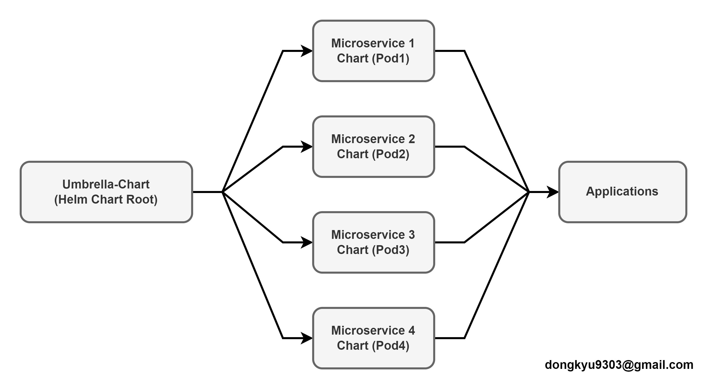
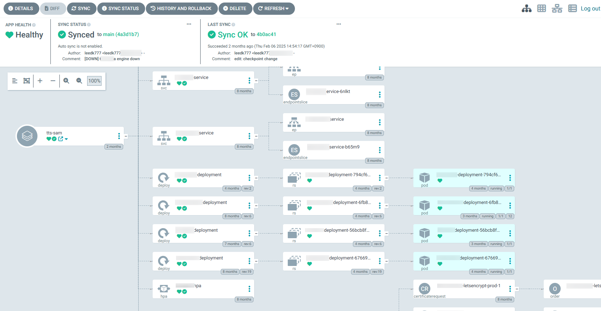

# Umbrella Chart Portfolio




Umbrella Chart 는 여러 개의 서브차트(pod1, pod2, pod3, pod4)를 하나의 상위 차트로 묶어 관리하는 Helm Chart입니다. 이 차트를 사용하면 각 애플리케이션을 개별적으로 관리하면서, 한 번의 명령어로 전체 애플리케이션을 배포할 수 있습니다.

## 구성 요소

- **pod1:**
- **pod2:**
- **pod3:**
- **pod4:**

각 서브차트는 독립적인 Helm Chart로 구성되어 있으며, 상위 `values.yaml` 파일을 통해 개별 설정 값을 오버라이드할 수 있습니다.

## 디렉터리 구조

```
umbrella-chart-portfolio/
├── Chart.yaml             # 상위 Chart의 메타데이터 및 의존성 정의
├── values.yaml            # 상위 Chart의 기본 설정 값
├── charts/                # 서브차트들이 위치하는 폴더
│   ├── pod1/
│   │   ├── Chart.yaml
│   │   └── templates/
│   │       ├── _pod1_helpers.tpl
│   │       ├── configmap.yaml
│   │       ├── deployment.yaml
│   │       ├── hpa.yaml
│   │       ├── ingress.yaml
│   │       └── service.yaml
│   ├── pod2/
│   │   ├── Chart.yaml
│   │   └── templates/
│   │       ├── _pod2_helpers.tpl
│   │       ├── configmap.yaml
│   │       ├── deployment.yaml
│   │       ├── ingress.yaml
│   │       └── service.yaml
│   ├── pod3/
│   │   ├── Chart.yaml
│   │   └── templates/
│   │       ├── _pod3_helpers.tpl
│   │       ├── configmap.yaml
│   │       ├── deployment.yaml
│   │       ├── hpa.yaml
│   │       └── service.yaml
│   └── pod4/
│       ├── Chart.yaml
│       └── templates/
│           ├── _pod4_helpers.tpl
│           ├── configmap.yaml
│           ├── deployment.yaml
│           ├── hpa.yaml
│           └── service.yaml
```

## 요구사항

- **Helm:** v3.x 이상
- **Kubernetes:** v1.27 이상

## 1. Helm Chart Repository 구성 및 배포
Chart를 외부에서 공유하거나 배포하려면 Helm Repository 형태로 패키징해야 합니다.

### 1-1. 서브차트 의존성 업데이트

Umbrella Chart 디렉터리에서 다음 명령어를 실행하여 서브차트 의존성을 업데이트합니다.

```bash
helm dependency update
# 또는
helm dep update
```

### 1-2. 차트 패키징

Umbrella Chart 디렉터리에서 다음 명령어를 실행하여 차트를 패키징합니다.  

```bash
helm package .
```
> 이 명령은 상위 차트와 내부 서브차트 의존성 정보를 포함한 `.tgz` 파일을 생성합니다. `Chart.yaml`이 있는 디렉터리에서 실행

### 1-3. index.yaml 파일 생성

패키징된 차트 파일들이 위치한 디렉터리에서 다음 명령어를 실행하여 Helm Repository의 **index.yaml** 파일을 생성합니다.  

```bash
helm repo index .
```
> 패키징된 `.tgz`파일이 있는 디렉터리에서 실행해야 합니다.

### 1-4. Repository 등록 및 확인

생성된 Repository를 Helm에 등록합니다.

```bash
helm repo add umbrella-chart https://dongkyueo-ros.github.io/umbrella-chart-portfolio/
helm repo update
helm repo list
```
> `helm repo list` 명령어로 등록된 Repository를 확인할 수 있습니다.

## 2. 클러스터에 차트 설치 및 배포

### 2-1. 차트 다운로드 및 압축 해제

전체 Chart를 Kubernetes 클러스터에 설치하려면, 먼저 Helm Repository 에서 차트를 다운로드 한 후 필요한 값들을 할당하여 설치하는 것을 권장합니다.

#### Helm Repository 에서 차트 다운로드 (압축 해제)

```bash
helm pull umbrella-chart/umbrella-chart --untar --untar
```
> 이 명령어를 실행하면, 저장소에 등록된 `umbrella-chart` 차트를 다운로드하고 압축 해제하여 로컬 디렉터리에 저장합니다.

### 2-2. 값 확인 및 설치

```bash
helm install umbrella ./umbrella-chart
```
> ⚠️ `values.yaml` 파일 내 기본 값이 제대로 설정되지 않으면 설치에 실패할 수 있으므로, 사전에 확인 후 수정이 필요합니다.


### 2-3. 차트 업그레이드

설정 값을 변경한 후 업그레이드하려면 다음 명령어를 사용합니다.

```bash
helm upgrade umbrella ./umbrella-chart
```

## 주요 설정 값 (values.yaml)

상위 `values.yaml` 파일을 통해 각 서브차트의 설정 값을 오버라이드할 수 있습니다. 예를 들어:

```yaml
pod1:
  replicaCount: 2
  image:
    repository: nginx
    tag: latest

pod2:
  replicaCount: 1
  image:
    repository: redis
    tag: stable

pod3:
  replicaCount: 1
  image:
    repository: busybox
    tag: latest

pod4:
  replicaCount: 1
  image:
    repository: alpine
    tag: latest
```

> 설정 값은 두 가지 방식으로 오버라이드할 수 있습니다.

### 1. `--set` 옵션 사용 (간단한 테스트용)
```bash
helm install umbrella-chart ./umbrella-chart \
  --set pod1.replicaCount=3 \
  --set pod2.image.tag=latest
```
### 2. 커트텀 값 파일 사용(`test-values.yaml` 등)
```bash
helm install umbrella-chart ./umbrella-chart -f test-values.yaml
```
> 이 방식은 설정이 많거나 반복 테스트 시 특히 유용합니다.

## Health Check 설정

각 서브차트의 Deployment 템플릿에는 다음과 같은 Health Check(프로브) 설정이 포함되어 있습니다:

- **startupProbe:** 컨테이너 시작 시 상태를 확인하여, 시작에 실패한 경우 적절한 조치를 취합니다. (컨테이너 초기 구동 확인)
- **livenessProbe:** 컨테이너가 정상적으로 동작하고 있는지 주기적으로 확인하여, 문제가 발생하면 재시작합니다. (서비스가 살아있는지 확인)
- **readinessProbe:** 컨테이너가 서비스 요청을 처리할 준비가 되었는지 확인하여, 준비되기 전에는 트래픽을 받지 않습니다. (트래픽 처리 준비 여부 확인)

## 업데이트 전략

Deployment 업데이트 시, 다음과 같은 Rolling Update 전략을 사용합니다:

```yaml
strategy:
  type: RollingUpdate
  rollingUpdate:
    maxUnavailable: 0
    maxSurge: 1
```
> 업데이트 도중 항상 충분한 수의 Pod가 가동되도록 하여 서비스 중단 없이 점진적으로 업데이트를 수행합니다.

## 테스트 및 검증

Chart가 성공적으로 배포되었는지 확인하려면 다음 명령어를 사용합니다.

```bash
kubectl get pods -n <namespace>
```
> 각 서브차트의 로그를 확인하여 애플리케이션 상태를 검증할 수 있습니다.

## 차트 제거

배포한 Chart를 제거하려면 다음 명령어를 실행합니다:

```bash
helm uninstall umbrella-chart
```

## 기여 및 유지보수

- 버그 리포트나 기능 요청은 GitHub 이슈를 통해 받고 있으며, Pull Request도 환영합니다.